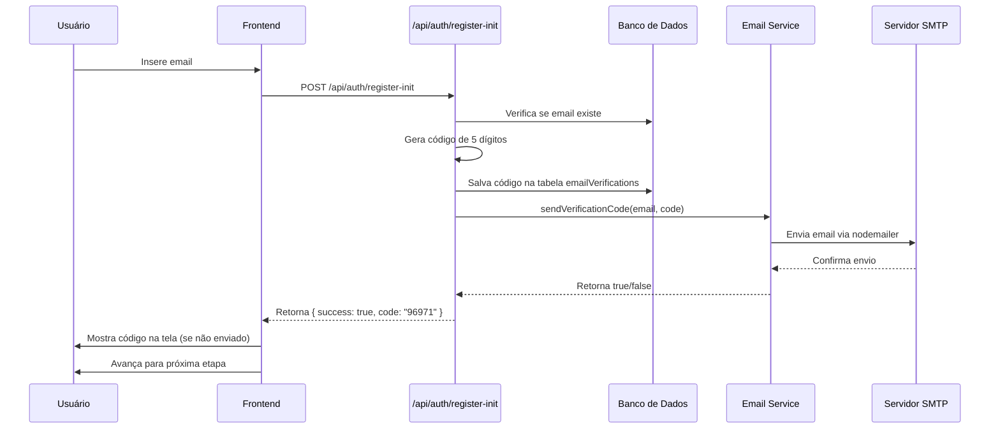

# 📧 Configuração do Envio de Email

## 🔍 Como Funciona o Envio de Código de Verificação

### Fluxo Atual

1. **Usuário insere email** → `/api/auth/register-init`
2. **Sistema gera código de 5 dígitos** → Ex: `96971`
3. **Código é salvo no banco** → Tabela `emailVerifications`
4. **Tenta enviar email** → Via `emailService.sendVerificationCode()`
5. **Retorna sucesso** → Mesmo se email não foi enviado (para não bloquear o fluxo)

### 📁 Arquivos Envolvidos

```
src/lib/email-service.ts          → Serviço de envio de email
src/app/api/auth/register-init/route.ts  → Endpoint que gera e envia código
src/app/register/page.tsx         → Interface do usuário
```

## ⚙️ Configuração Necessária

### Variáveis de Ambiente (.env.local)

```env
# Email SMTP Configuration
SMTP_HOST=smtp.gmail.com
SMTP_PORT=587
SMTP_USER=seu-email@gmail.com
SMTP_PASS=sua-senha-de-app
SMTP_FROM=noreply@rivieratickets.com
```

### Exemplos de Provedores SMTP

#### Gmail
```env
SMTP_HOST=smtp.gmail.com
SMTP_PORT=587
SMTP_USER=seu-email@gmail.com
SMTP_PASS=sua-senha-de-app-gmail  # Senha de app, não a senha normal
```

**Como obter senha de app do Gmail:**
1. Acesse: https://myaccount.google.com/apppasswords
2. Gere uma senha de app
3. Use essa senha no `SMTP_PASS`

#### Outlook/Hotmail
```env
SMTP_HOST=smtp-mail.outlook.com
SMTP_PORT=587
SMTP_USER=seu-email@outlook.com
SMTP_PASS=sua-senha
```

#### SendGrid
```env
SMTP_HOST=smtp.sendgrid.net
SMTP_PORT=587
SMTP_USER=apikey
SMTP_PASS=SG.sua-api-key-aqui
```

#### Mailgun
```env
SMTP_HOST=smtp.mailgun.org
SMTP_PORT=587
SMTP_USER=postmaster@seu-dominio.mailgun.org
SMTP_PASS=sua-senha-mailgun
```

## 📧 Template do Email

O email enviado usa este template (em `src/lib/email-service.ts`):

```html
<!DOCTYPE html>
<html>
  <head>
    <meta charset="utf-8">
    <style>
      body { 
        font-family: Arial, sans-serif; 
        background-color: #000; 
        color: #fff; 
        padding: 20px; 
      }
      .container { 
        max-width: 600px; 
        margin: 0 auto; 
        background-color: #1c1c1c; 
        padding: 30px; 
        border-radius: 10px; 
      }
      .code { 
        font-size: 32px; 
        font-weight: bold; 
        letter-spacing: 8px; 
        text-align: center; 
        color: #0066FF; 
        margin: 30px 0; 
      }
    </style>
  </head>
  <body>
    <div class="container">
      <h1 style="color: #fff;">Verification Code</h1>
      <p>Your verification code is:</p>
      <div class="code">96971</div>
      <p>This code will expire in 10 minutes.</p>
      <p>If you didn't request this code, please ignore this email.</p>
      <div class="footer">
        <p>Riviera Tickets - IMAX 70mm Experience</p>
      </div>
    </div>
  </body>
</html>
```

## 🔄 Fluxo Completo


```mermaid
sequenceDiagram
    participant U as Usuário
    participant F as Frontend
    participant API as /api/auth/register-init
    participant DB as Banco de Dados
    participant ES as Email Service
    participant SMTP as Servidor SMTP

    U->>F: Insere email
    F->>API: POST /api/auth/register-init
    API->>DB: Verifica se email existe
    API->>API: Gera código de 5 dígitos
    API->>DB: Salva código na tabela emailVerifications
    API->>ES: sendVerificationCode(email, code)
    ES->>SMTP: Envia email via nodemailer
    SMTP-->>ES: Confirma envio
    ES-->>API: Retorna true/false
    API-->>F: Retorna { success: true, code: "96971" }
    F->>U: Mostra código na tela (se não enviado)
    F->>U: Avança para próxima etapa
```

## 🧪 Como Testar

### 1. Sem Email Configurado (Modo Desenvolvimento)

O código será exibido na tela automaticamente:

```typescript
// Em src/app/api/auth/register-init/route.ts
code: (process.env.NODE_ENV === 'development' || !emailSent) ? code : undefined
```

### 2. Com Email Configurado

1. Configure as variáveis de ambiente
2. Reinicie o servidor
3. Teste o fluxo de registro
4. Verifique a caixa de entrada do email

### 3. Verificar Logs

```bash
# No console do servidor, você verá:
Email service not configured. Code: 96971  # Se não configurado
# Ou
Verification email sent to: example@gmail.com  # Se configurado
```

## 🐛 Troubleshooting

### Email não está sendo enviado

1. **Verifique as variáveis de ambiente:**
   ```bash
   echo $SMTP_HOST
   echo $SMTP_USER
   ```

2. **Verifique os logs:**
   - Procure por "Email service not configured"
   - Procure por erros do nodemailer

3. **Teste a conexão SMTP:**
   ```typescript
   // Adicione temporariamente em email-service.ts
   console.log('SMTP Config:', {
     host: process.env.SMTP_HOST,
     port: process.env.SMTP_PORT,
     user: process.env.SMTP_USER,
     hasPass: !!process.env.SMTP_PASS
   })
   ```

### Gmail bloqueando

- Use senha de app, não a senha normal
- Ative "Acesso a apps menos seguros" (não recomendado)
- Use OAuth2 (mais seguro, requer configuração adicional)

### Código não aparece na tela

- Verifique se `NODE_ENV === 'development'`
- Verifique se `emailSent === false`
- Verifique o console do navegador para erros

## 📝 Código Atual

### email-service.ts
```typescript
async sendVerificationCode(email: string, code: string): Promise<boolean> {
  if (!this.transporter) {
    console.warn('Email service not configured. Code:', code)
    return false  // Não bloqueia o fluxo
  }

  try {
    const html = this.getVerificationEmailTemplate(code)
    
    await this.transporter.sendMail({
      from: process.env.SMTP_FROM || process.env.SMTP_USER,
      to: email,
      subject: 'Your Riviera Tickets Verification Code',
      html,
    })

    return true
  } catch (error) {
    console.error('Error sending verification email:', error)
    return false  // Não bloqueia o fluxo
  }
}
```

### register-init/route.ts
```typescript
// Tentar enviar email com código (não bloqueia se falhar)
const emailSent = await emailService.sendVerificationCode(email, code)

// Sempre retorna sucesso, mesmo se o email não foi enviado
return NextResponse.json({
  success: true,
  message: emailSent ? 'Código enviado por email' : 'Código gerado (email não configurado)',
  // Retornar código quando email não foi enviado ou em desenvolvimento
  code: (!emailSent || process.env.NODE_ENV === 'development') ? code : undefined
})
```

## ✅ Status Atual

- ✅ Serviço de email implementado
- ✅ Template HTML criado
- ✅ Integração com API de registro
- ✅ Código exibido na tela quando email não configurado
- ⚠️ **Pendente:** Configurar variáveis de ambiente SMTP

## 🚀 Próximos Passos

1. **Configurar variáveis de ambiente** no `.env.local`
2. **Testar envio de email** com um provedor SMTP
3. **Verificar se emails estão chegando** na caixa de entrada
4. **Ajustar template** se necessário
5. **Configurar SPF/DKIM** para melhorar deliverability (produção)

